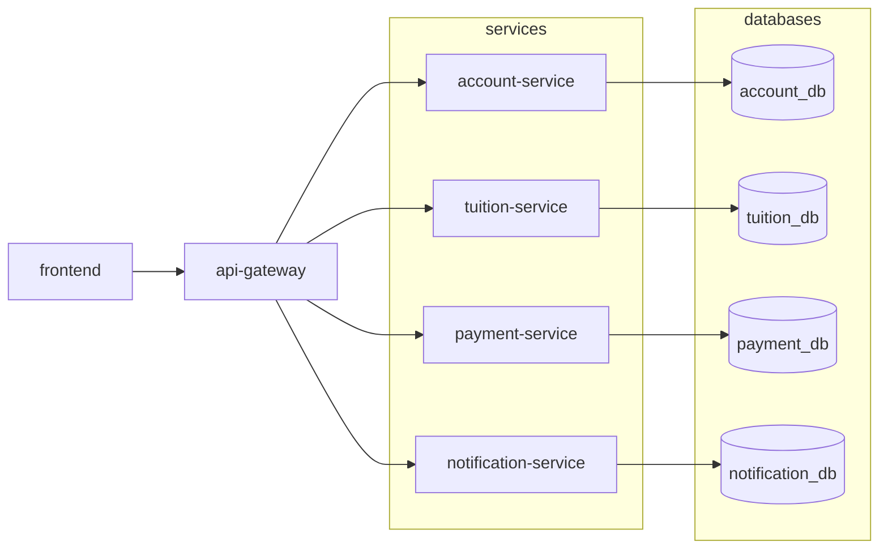

# iBanking Tuition Payment System

> Distributed Service-Oriented Architecture for university tuition settlement integrated with online iBanking, featuring high-concurrency control, distributed saga compensating transactions, and two-factor OTP authorization.

---

## 1. System Architecture



---

## 2. Topology & Network Ports

| Component | Technology | Public Port | Notes |
|---|---|---|---|
| **`frontend`** | React 18 + Vite + Tailwind + Shadcn UI | `3659` | Client user interface |
| **`api-gateway`** | FastAPI + HTTPX Reverse Proxy | `8877` | Single Entry Point, CORS & Error Mapping |
| **`account-service`** | Python 3.11 + FastAPI + Bcrypt | `8661` | Account management, balance, JWT authentication |
| **`tuition-service`** | Python 3.11 + FastAPI + aiomysql | `8732` | Student tuition ledger & invoice settlement |
| **`payment-service`** | Python 3.11 + FastAPI (Orchestrator) | `8815` | Saga orchestration, atomic settlement, compensation |
| **`notification-service`**| Python 3.11 + FastAPI + SMTPLib | `8940` | OTP generation & verification, mail dispatch |
| **MySQL** | MySQL 8.0 | `8552` | Multi-database isolated RDBMS (InnoDB) |
| **Mailpit** | axllent/mailpit | `8025` / `1025` | Mock SMTP server & email inspector |

---

## 3. Concurrency Control & Data Consistency Protocols

1. **Atomic Conditional Update:**
   - Account Balance Deduction: Utilizes MySQL atomic update with row-level locking: `UPDATE accounts SET balance = balance - :amount WHERE id = :id AND balance >= :amount`. If concurrent transactions arrive simultaneously, only one succeeds; others affect 0 rows and are rejected immediately.
   - Tuition Invoice Settlement: Utilizes MySQL atomic update: `UPDATE tuitions SET status = 'PAID' ... WHERE student_id = :id AND status = 'UNPAID'` directly at the database engine level.

2. **Compensating Transactions:**
   - If account balance deduction succeeds in `account-service`, but tuition settlement fails in `tuition-service`, `payment-service` automatically triggers `POST /api/accounts/refund` to revert the deduction and records transaction status as `FAILED`.

3. **Two-Factor OTP Token Lifecycle:**
   - 6-digit OTP tokens are persisted directly in MySQL with a 5-minute expiration timestamp (`expires_at`).
   - Verification atomically transitions `is_used = TRUE` to eliminate replay attacks.

---

## 4. Installation & Execution Guide

### 1. Prerequisites
- Docker & Docker Compose
- Node.js 18+

### 2. Start Full Stack with Docker Compose
```bash
# Clone repository
git clone <repository_url>
cd soa

# Build and start all backend microservices, gateway, database, and mailpit
docker compose up --build -d
```

### 3. Start Frontend
```bash
cd frontend
npm install
npm run dev
```
Access the application at: **http://localhost:3659**

---

## 5. Test Fixtures & Seed Data

Data is automatically seeded from `init-db/init-mysql.sql` on the initial startup of the MySQL container.

### Sample iBanking Accounts:
| Username | Password | Full Name | Available Balance |
|---|---|---|---|
| `sv.nguyen` | `Test@123` | Nguyen Van An | **7,500,000 VND** |
| `sv.tran` | `Test@123` | Tran Thi Bao | **2,300,000 VND** |
| `sv.le` | `Ibank@456` | Le Hoang Cuong | **12,000,000 VND** |

### Sample Unpaid Student Tuitions:
| Student ID | Full Name | Major | Semester | Tuition Amount | Status |
|---|---|---|---|---|---|
| `521H0001` | Nguyen Van An | Computer Science | HK1/2024-2025 | 4,850,000 VND | `UNPAID` |
| `521H0002` | Tran Thi Bao | Accounting | HK1/2024-2025 | 3,620,000 VND | `UNPAID` |
| `521H0003` | Le Hoang Cuong | Electrical Engineering | HK1/2024-2025 | 5,130,000 VND | `UNPAID` |
| `522H0017` | Pham Duc Dung | Business Administration| HK1/2024-2025 | 3,975,000 VND | `UNPAID` |
| `522H0041` | Hoang Thi Yen | English Linguistics | HK1/2024-2025 | 3,280,000 VND | `UNPAID` |
| `523H0089` | Vo Minh Khoa | Computer Science | HK1/2024-2025 | 4,720,000 VND | `UNPAID` |

---

## 6. API Endpoints

| Method | Endpoint | Description | Auth Required |
|---|---|---|---|
| `POST` | `/api/accounts/login` | iBanking login, returns JWT access token | No |
| `GET` | `/api/accounts/me` | Fetch user profile & available balance | Bearer Token |
| `GET` | `/api/tuitions/students/{mssv}` | Query tuition record by student ID | No |
| `POST` | `/api/payments/initiate` | Initiate payment session & dispatch OTP | Bearer Token |
| `POST` | `/api/payments/confirm` | Confirm OTP, deduct balance, mark tuition paid | Bearer Token |
| `GET` | `/api/payments/history` | Retrieve transaction payment history | Bearer Token |
| `GET` | `/health` | API Gateway health probe | No |
