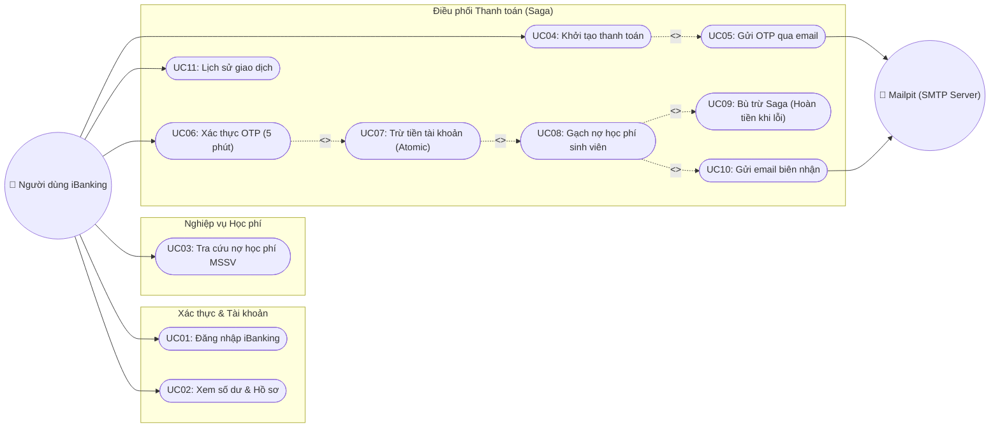
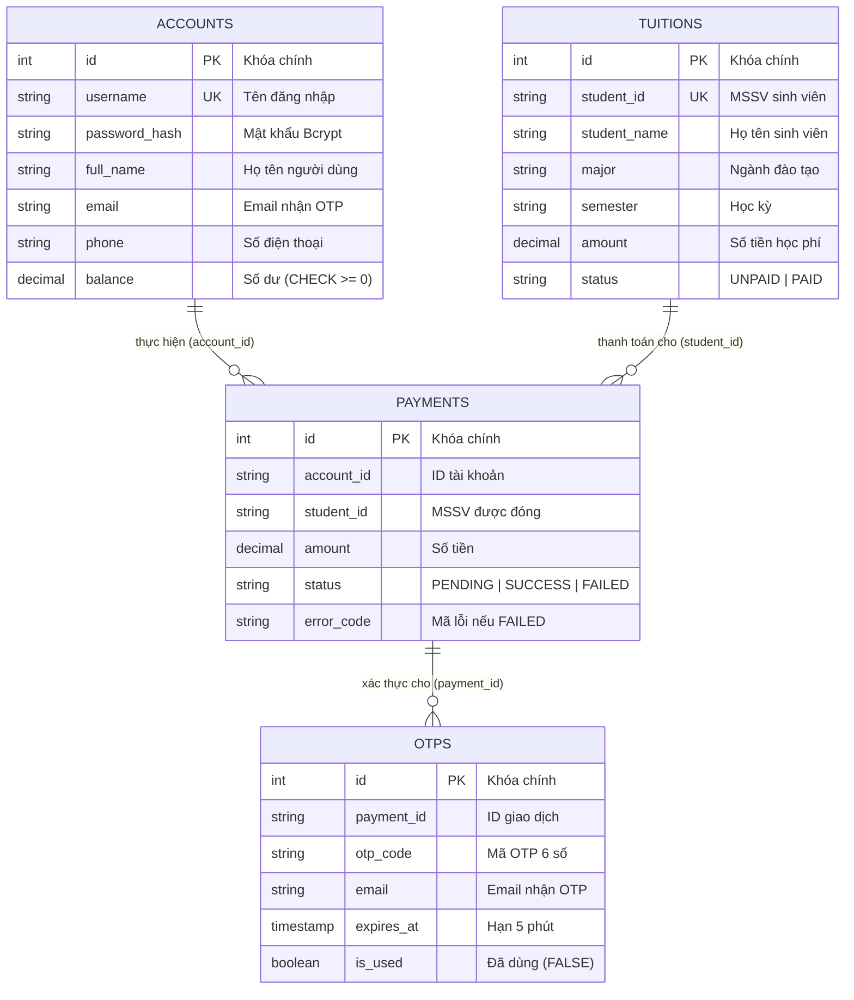
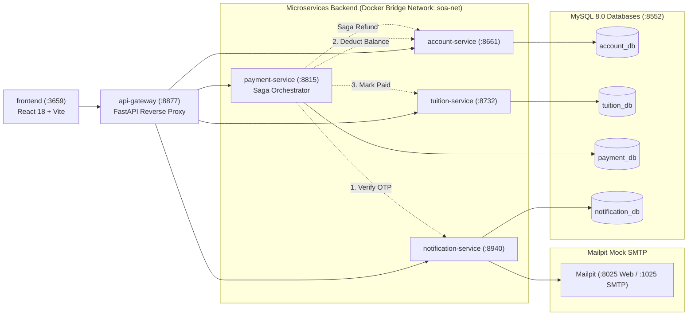

# iBanking Tuition Payment System (SOA Architecture)

> **Kiến trúc hướng dịch vụ (Service-Oriented Architecture - SOA)** phục vụ thanh toán học phí đại học tích hợp ngân hàng điện tử iBanking, kiểm soát đồng thời mức cơ sở dữ liệu (Atomic Concurrency Control), điều phối bù trừ giao dịch phân tán (Distributed Saga Compensation) và xác thực OTP 2 lớp.  
> **Môn học:** Kiến Trúc Hướng Dịch Vụ (504070) — Trường Đại Học Tôn Đức Thắng (HK1 / 2026–2027)

---

## 1. Phân Chia Trách Nhiệm 3 Thành Viên (Team Assignment)

| Thành Viên | Phạm Vi & Dịch Vụ Phụ Trách | Database | Hướng Dẫn Chi Tiết Từng Service |
|:---|:---|:---|:---|
| **Member 1** | **`account-service`** (Port `8661`) | `account_db` | 📖 [Tài liệu chi tiết Account Service](./backend/account-service/README.md) |
| **Member 2** | **`tuition-service`** (Port `8732`)<br>**`notification-service`** (Port `8940`) | `tuition_db`<br>`notification_db` | 📖 [Tài liệu chi tiết Tuition Service](./backend/tuition-service/README.md)<br>📖 [Tài liệu chi tiết Notification Service](./backend/notification-service/README.md) |
| **Member 3** | **`payment-service`** (Port `8815`)<br>**`api-gateway`** (Port `8877`)<br>**`frontend`** (Port `3659`) | `payment_db` | 📖 [Tài liệu chi tiết Payment Service](./backend/payment-service/README.md)<br>📖 [Tài liệu chi tiết API Gateway](./api-gateway/README.md)<br>📖 [Tài liệu chi tiết Frontend](./frontend/README.md) |

📘 **Xem toàn bộ phân tích UML & Thiết kế hệ thống tại:** [**`docs/SYSTEM_DESIGN.md`**](./docs/SYSTEM_DESIGN.md)

---

## 2. Thiết Kế Nghiệp Vụ & Dữ Liệu (UML & ERD)

### 2.1 Biểu Đồ Ca Sử Dụng (Use Case Diagram)

```mermaid
flowchart LR
    user(("👤 Người dùng iBanking"))
    smtp(("📧 Mailpit (SMTP Server)"))
    
    subgraph auth_sub ["Xác thực & Tài khoản"]
        uc_login(["UC01: Đăng nhập iBanking"])
        uc_profile(["UC02: Xem số dư & Hồ sơ"])
    end

    subgraph tuition_sub ["Nghiệp vụ Học phí"]
        uc_search(["UC03: Tra cứu nợ học phí MSSV"])
    end

    subgraph payment_sub ["Điều phối Thanh toán (Saga)"]
        uc_initiate(["UC04: Khởi tạo thanh toán"])
        uc_otp_send(["UC05: Gửi OTP qua email"])
        uc_otp_verify(["UC06: Xác thực OTP (5 phút)"])
        uc_deduct(["UC07: Trừ tiền tài khoản (Atomic)"])
        uc_pay(["UC08: Gạch nợ học phí sinh viên"])
        uc_refund(["UC09: Bù trừ Saga (Hoàn tiền khi lỗi)"])
        uc_receipt(["UC10: Gửi email biên nhận"])
        uc_history(["UC11: Lịch sử giao dịch"])
    end

    user --> uc_login
    user --> uc_profile
    user --> uc_search
    user --> uc_initiate
    user --> uc_otp_verify
    user --> uc_history

    uc_initiate -.->|<<include>>| uc_otp_send
    uc_otp_send --> smtp

    uc_otp_verify -.->|<<include>>| uc_deduct
    uc_deduct -.->|<<include>>| uc_pay
    uc_pay -.->|<<extend: khi trùng nợ>>| uc_refund
    uc_pay -.->|<<include: khi thành công>>| uc_receipt
    uc_receipt --> smtp
```

### 2.2 Sơ Đồ Quan Hệ Thực Thể (ERD - Database-per-Service)

```mermaid
erDiagram
    ACCOUNTS ||--o{ PAYMENTS : "thực hiện (account_id)"
    TUITIONS ||--o{ PAYMENTS : "thanh toán cho (student_id)"
    PAYMENTS ||--o{ OTPS : "xác thực cho (payment_id)"

    ACCOUNTS {
        int id PK "Khóa chính"
        string username UK "Tên đăng nhập"
        string password_hash "Mật khẩu Bcrypt"
        string full_name "Họ tên người dùng"
        string email "Email nhận OTP"
        string phone "Số điện thoại"
        decimal balance "Số dư (CHECK >= 0)"
    }

    TUITIONS {
        int id PK "Khóa chính"
        string student_id UK "MSSV sinh viên"
        string student_name "Họ tên sinh viên"
        string major "Ngành đào tạo"
        string semester "Học kỳ"
        decimal amount "Số tiền học phí"
        string status "UNPAID | PAID"
    }

    PAYMENTS {
        int id PK "Khóa chính"
        string account_id "ID tài khoản"
        string student_id "MSSV được đóng"
        decimal amount "Số tiền"
        string status "PENDING | SUCCESS | FAILED"
        string error_code "Mã lỗi nếu FAILED"
    }

    OTPS {
        int id PK "Khóa chính"
        string payment_id "ID giao dịch"
        string otp_code "Mã OTP 6 số"
        string email "Email nhận OTP"
        timestamp expires_at "Hạn 5 phút"
        boolean is_used "Đã dùng (FALSE)"
    }
```

---

## 3. Kiến Trúc Tổng Thể (Microservices Architecture)


```mermaid
flowchart LR
    frontend["frontend (:3659)\nReact 18 + Vite"] --> api-gateway["api-gateway (:8877)\nFastAPI Reverse Proxy"]

    subgraph services ["Microservices Backend (Docker Bridge Network: soa-net)"]
        direction TB
        account-service["account-service (:8661)"]
        tuition-service["tuition-service (:8732)"]
        payment-service["payment-service (:8815)\nSaga Orchestrator"]
        notification-service["notification-service (:8940)"]
    end

    subgraph databases ["MySQL 8.0 Databases (:8552)"]
        direction TB
        account_db[("account_db")]
        tuition_db[("tuition_db")]
        payment_db[("payment_db")]
        notification_db[("notification_db")]
    end

    subgraph mailpit ["Mailpit Mock SMTP"]
        mailpit_srv["Mailpit (:8025 Web / :1025 SMTP)"]
    end

    api-gateway --> account-service
    api-gateway --> tuition-service
    api-gateway --> payment-service
    api-gateway --> notification-service

    account-service --> account_db
    tuition-service --> tuition_db
    payment-service --> payment_db
    notification-service --> notification_db
    notification-service --> mailpit_srv

    payment-service -.->|1. Verify OTP| notification-service
    payment-service -.->|2. Deduct Balance| account-service
    payment-service -.->|3. Mark Paid| tuition-service
    payment-service -.->|Saga Refund| account-service
```

---

## 4. Danh Mục Port & Công Nghệ

| Thành Phần | Công Nghệ | Port Công Khai | Vai Trò & Trách Nhiệm |
|:---|:---|:---|:---|
| **`frontend`** | React 18 + Vite + Tailwind + Shadcn UI | `3659` | Giao diện người dùng iBanking (Tra cứu, OTP, Hoá đơn, Lịch sử) |
| **`api-gateway`** | FastAPI + HTTPX Reverse Proxy | `8877` | Cổng vào duy nhất, định tuyến, CORS, mapping lỗi mạng |
| **`account-service`** | Python 3.11 + FastAPI + Bcrypt | `8661` | Quản lý tài khoản, Bcrypt, JWT auth, trừ tiền/hoàn tiền atomic |
| **`tuition-service`** | Python 3.11 + FastAPI + aiomysql | `8732` | Quản lý sổ nợ học phí sinh viên, gạch nợ atomic |
| **`payment-service`** | Python 3.11 + FastAPI (Orchestrator) | `8815` | **Saga Orchestrator**, điều phối trừ tiền $\rightarrow$ gạch nợ $\rightarrow$ hoàn tiền |
| **`notification-service`**| Python 3.11 + FastAPI + SMTPLib | `8940` | Sinh OTP 6 số (5 phút), xác thực chống replay, gửi mail qua Mailpit |
| **MySQL 8.0** | MySQL Server (InnoDB) | `8552` | Cung cấp 4 logical databases độc lập, cô lập hoàn toàn |
| **Mailpit** | axllent/mailpit | `8025` (Web) / `1025` (SMTP) | Mock SMTP server & Web Inspector xem mã OTP gửi qua email |

---

## 5. Các Nguyên Tắc Kỹ Thuật Bắt Buộc (Core Principles)

1. **Kiểm Soát Đồng Thời Bằng Atomic Conditional Update (Concurrency Control):**
   - **Trừ số dư an toàn:**
     ```sql
     UPDATE accounts SET balance = balance - :amount WHERE id = :id AND balance >= :amount;
     ```
     Kết hợp ràng buộc CSDL `CONSTRAINT chk_balance CHECK (balance >= 0)` để triệt tiêu race condition thấu chi âm tiền.
   - **Gạch nợ học phí an toàn:**
     ```sql
     UPDATE tuitions SET status = 'PAID', paid_at = NOW(), paid_by = :user_id, transaction_id = :txn WHERE student_id = :mssv AND status = 'UNPAID';
     ```
   - **Xác thực OTP chống Replay:**
     ```sql
     UPDATE otps SET is_used = TRUE WHERE payment_id = :id AND otp_code = :code AND is_used = FALSE AND expires_at >= NOW();
     ```
2. **Saga Compensation (Bù Trừ Giao Dịch Phân Tán):**
   - Nếu trừ tiền ở `account-service` thành công nhưng bước gạch nợ ở `tuition-service` thất bại (ví dụ: đã bị người khác thanh toán trước) $\rightarrow$ `payment-service` lập tức kích hoạt `POST /api/accounts/refund` để hoàn trả 100% tiền về tài khoản người dùng và chuyển trạng thái giao dịch thành `FAILED` với mã lỗi `TUITION_MARK_FAILED`.
3. **Cô Lập Database (Database-per-Service):**
   - Tuyệt đối không query trực tiếp hay đặt Foreign Key xuyên các database khác nhau.

---

## 6. Dữ Liệu Mẫu (Seed Fixtures)

### Tài khoản iBanking mẫu:
| Username | Password | Họ và Tên | Số Dư Khả Dụng |
|:---|:---|:---|:---|
| `sv.nguyen` | `Test@123` | Nguyen Van An | **7,500,000 VND** |
| `sv.tran` | `Test@123` | Tran Thi Bao | **2,300,000 VND** |
| `sv.le` | `Ibank@456` | Le Hoang Cuong | **12,000,000 VND** |

### Mã Sinh Viên nợ học phí:
| MSSV | Họ và Tên | Ngành | Học Kỳ | Học Phí | Trạng Thái |
|:---|:---|:---|:---|:---|:---|
| `521H0001` | Nguyen Van An | Cong nghe Thong tin | HK1/2024-2025 | **4,850,000 VND** | `UNPAID` |
| `521H0002` | Tran Thi Bao | Ke toan | HK1/2024-2025 | **3,620,000 VND** | `UNPAID` |
| `521H0003` | Le Hoang Cuong | Ky thuat Dien tu | HK1/2024-2025 | **5,130,000 VND** | `UNPAID` |
| `522H0017` | Pham Duc Dung | Quan tri Kinh doanh | HK1/2024-2025 | **3,975,000 VND** | `UNPAID` |
| `522H0041` | Hoang Thi Yen | Ngon ngu Anh | HK1/2024-2025 | **3,280,000 VND** | `UNPAID` |
| `523H0089` | Vo Minh Khoa | Cong nghe Thong tin | HK1/2024-2025 | **4,720,000 VND** | `UNPAID` |

---

## 7. Hướng Dẫn Khởi Chạy Toàn Bộ Hệ Thống

Chỉ cần **1 lệnh duy nhất** để khởi chạy toàn bộ Hệ thống (Frontend + API Gateway + 4 Services + MySQL + Mailpit):

```bash
# Khởi chạy toàn bộ hệ thống bằng Docker Compose
docker compose up --build -d
```

### Các đường dẫn truy cập:
* 🌐 **Giao diện Web Frontend:** [http://localhost:3659](http://localhost:3659)
* 🚪 **API Gateway Health Check:** [http://localhost:8877/health](http://localhost:8877/health)
* 📧 **Hộp thư Mailpit Web UI (Xem mã OTP & Biên nhận):** [http://localhost:8025](http://localhost:8025)

---

## 8. Chạy Kiểm Thử Tự Động Tranh Chấp Đồng Thời (Concurrency Test Demo)

Dự án cung cấp bộ script kiểm thử tự động phục vụ demo trước giảng viên (Tiêu chí 6 trong Barem điểm):

```bash
# Cài đặt thư viện httpx nếu chưa có
pip install httpx

# Chạy kịch bản kiểm thử 2 tình huống concurrency
python backend/tests/test_concurrency.py
```

### Kịch bản tự động kiểm tra:
1. **Kịch bản 1 (Overdrawing Prevention):** Bắn 2 yêu cầu trừ tiền 1,500,000 VND đồng thời vào tài khoản `sv.tran` (số dư 2,300,000 VND). Script xác minh chính xác 1 request thành công, 1 request bị từ chối và số dư không bao giờ âm.
2. **Kịch bản 2 (Double Payment & Saga Compensation):** 2 tài khoản khác nhau (`sv.nguyen` và `sv.le`) cùng xác nhận thanh toán cho MSSV `523H0089` tại cùng một thời điểm. Script xác minh:
   * Chỉ 1 tài khoản thanh toán thành công và học phí chuyển thành `PAID`.
   * Tài khoản còn lại bị từ chối và được **Saga Compensation hoàn lại tiền ngay lập tức**, không bị thất thoát tiền.
