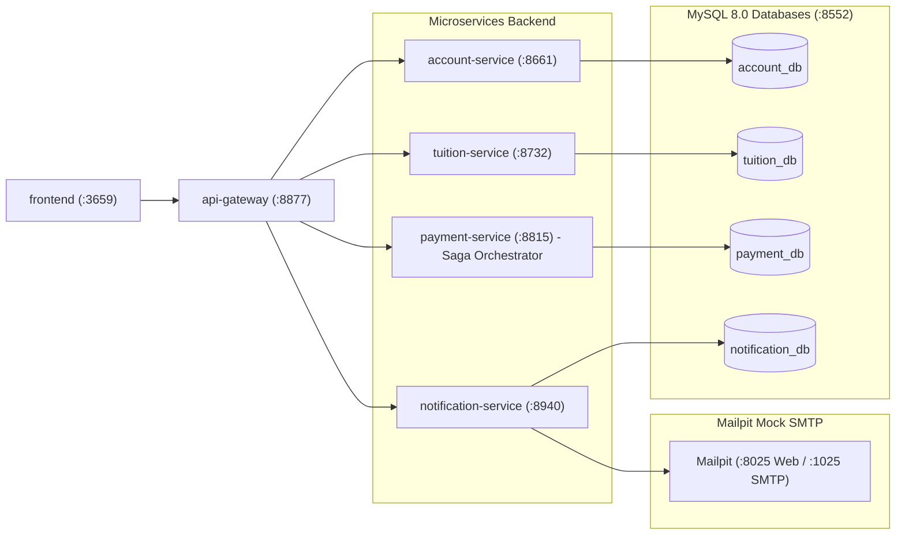

# iBanking Tuition Payment System (SOA Architecture)

> **Kiến trúc hướng dịch vụ (Service-Oriented Architecture - SOA)** phục vụ thanh toán học phí đại học tích hợp ngân hàng điện tử iBanking, kiểm soát đồng thời mức cơ sở dữ liệu (Atomic Concurrency Control), điều phối bù trừ giao dịch phân tán (Distributed Saga Compensation) và xác thực OTP 2 lớp.

---

## 1. Phân Chia Trách Nhiệm 3 Thành Viên (Team Assignment)

| Thành Viên | Phạm Vi & Dịch Vụ Phụ Trách | Database | Hướng Dẫn Chi Tiết Từng Service |
|:---|:---|:---|:---|
| **Member 1** | **`account-service`** (Port `8661`) | `account_db` | 📖 [Tài liệu chi tiết Account Service](file:///d:/TDTU/KTHDV/GK/soa/backend/account-service/README.md) |
| **Member 2** | **`tuition-service`** (Port `8732`)<br>**`notification-service`** (Port `8940`) | `tuition_db`<br>`notification_db` | 📖 [Tài liệu chi tiết Tuition Service](file:///d:/TDTU/KTHDV/GK/soa/backend/tuition-service/README.md)<br>📖 [Tài liệu chi tiết Notification Service](file:///d:/TDTU/KTHDV/GK/soa/backend/notification-service/README.md) |
| **Member 3** | **`payment-service`** (Port `8815`)<br>**`api-gateway`** (Port `8877`)<br>**`frontend`** (Port `3659`) | `payment_db` | 📖 [Tài liệu chi tiết Payment Service](file:///d:/TDTU/KTHDV/GK/soa/backend/payment-service/README.md)<br>📖 [Tài liệu chi tiết API Gateway](file:///d:/TDTU/KTHDV/GK/soa/api-gateway/README.md)<br>📖 [Tài liệu chi tiết Frontend](file:///d:/TDTU/KTHDV/GK/soa/frontend/README.md) |

---

## 2. Kiến Trúc Tổng Thể (System Architecture)


```mermaid
flowchart LR
    frontend["frontend (:3659)"] --> api-gateway["api-gateway (:8877)"]

    subgraph services ["Microservices Backend"]
        direction TB
        account-service["account-service (:8661)"]
        tuition-service["tuition-service (:8732)"]
        payment-service["payment-service (:8815) - Saga Orchestrator"]
        notification-service["notification-service (:8940)"]
    end

    subgraph databases ["MySQL 8.0 Databases (:8552)"]
        direction TB
        account_db[("account_db")]
        tuition_db[("tuition_db")]
        payment_db[("payment_db")]
        notification_db[("notification_db")]
    end

    subgraph mailpit ["Mailpit Mock SMTP"]
        mailpit_srv["Mailpit (:8025 Web / :1025 SMTP)"]
    end

    api-gateway --> account-service
    api-gateway --> tuition-service
    api-gateway --> payment-service
    api-gateway --> notification-service

    account-service --> account_db
    tuition-service --> tuition_db
    payment-service --> payment_db
    notification-service --> notification_db
    notification-service --> mailpit_srv
```

---

## 3. Danh Mục Port & Công Nghệ

| Thành Phần | Công Nghệ | Port Công Khai | Vai Trò & Trách Nhiệm |
|:---|:---|:---|:---|
| **`frontend`** | React 18 + Vite + Tailwind + Shadcn UI | `3659` | Giao diện người dùng iBanking |
| **`api-gateway`** | FastAPI + HTTPX Reverse Proxy | `8877` | Cổng vào duy nhất, định tuyến, CORS, mapping lỗi |
| **`account-service`** | Python 3.11 + FastAPI + Bcrypt | `8661` | Quản lý tài khoản, mật khẩu Bcrypt, JWT auth, trừ tiền/hoàn tiền |
| **`tuition-service`** | Python 3.11 + FastAPI + aiomysql | `8732` | Quản lý sổ nợ học phí sinh viên, gạch nợ atomic |
| **`payment-service`** | Python 3.11 + FastAPI (Orchestrator) | `8815` | **Saga Orchestrator**, điều phối trừ tiền $\rightarrow$ gạch nợ $\rightarrow$ hoàn tiền |
| **`notification-service`**| Python 3.11 + FastAPI + SMTPLib | `8940` | Sinh OTP 6 số (5 phút), xác thực chống replay, gửi mail qua Mailpit |
| **MySQL 8.0** | MySQL Server (InnoDB) | `8552` | Cung cấp 4 logical databases độc lập, cô lập hoàn toàn |
| **Mailpit** | axllent/mailpit | `8025` (Web) / `1025` (SMTP) | Mock SMTP server & Web Inspector xem mã OTP gửi qua email |

---

## 4. Các Nguyên Tắc Kỹ Thuật Bắt Buộc (Core Principles)

1. **Kiểm Soát Đồng Thời Bằng Atomic Conditional Update:**
   - **Trừ số dư:** `UPDATE accounts SET balance = balance - :amount WHERE id = :id AND balance >= :amount;`
   - **Gạch nợ học phí:** `UPDATE tuitions SET status = 'PAID', paid_at = NOW(), paid_by = :user_id, transaction_id = :txn WHERE student_id = :mssv AND status = 'UNPAID';`
   - **Xác thực OTP:** `UPDATE otps SET is_used = TRUE WHERE payment_id = :id AND otp_code = :code AND is_used = FALSE AND expires_at >= NOW();`
2. **Saga Compensation (Bù Trừ Phân Tán):**
   - Nếu trừ tiền ở `account-service` thành công nhưng bước gạch nợ ở `tuition-service` thất bại $\rightarrow$ `payment-service` tự động kích hoạt `POST /api/accounts/refund` để hoàn tiền về tài khoản người dùng và chuyển trạng thái giao dịch thành `FAILED`.
3. **Cô Lập Database (Database Isolation):**
   - Tuyệt đối không query trực tiếp hay đặt Foreign Key xuyên các database khác nhau.

---

## 5. Dữ Liệu Mẫu (Seed Fixtures)

### Tài khoản iBanking mẫu:
| Username | Password | Họ và Tên | Số Dư Khả Dụng |
|:---|:---|:---|:---|
| `sv.nguyen` | `Test@123` | Nguyen Van An | **7,500,000 VND** |
| `sv.tran` | `Test@123` | Tran Thi Bao | **2,300,000 VND** |
| `sv.le` | `Ibank@456` | Le Hoang Cuong | **12,000,000 VND** |

### Mã Sinh Viên nợ học phí:
| MSSV | Họ và Tên | Ngành | Học Kỳ | Học Phí | Trạng Thái |
|:---|:---|:---|:---|:---|:---|
| `521H0001` | Nguyen Van An | Cong nghe Thong tin | HK1/2024-2025 | **4,850,000 VND** | `UNPAID` |
| `521H0002` | Tran Thi Bao | Ke toan | HK1/2024-2025 | **3,620,000 VND** | `UNPAID` |
| `521H0003` | Le Hoang Cuong | Ky thuat Dien tu | HK1/2024-2025 | **5,130,000 VND** | `UNPAID` |
| `522H0017` | Pham Duc Dung | Quan tri Kinh doanh | HK1/2024-2025 | **3,975,000 VND** | `UNPAID` |
| `522H0041` | Hoang Thi Yen | Ngon ngu Anh | HK1/2024-2025 | **3,280,000 VND** | `UNPAID` |
| `523H0089` | Vo Minh Khoa | Cong nghe Thong tin | HK1/2024-2025 | **4,720,000 VND** | `UNPAID` |

---

## 6. Hướng Dẫn Chạy Toàn Bộ Hệ Thống

```bash
# 1. Khởi chạy toàn bộ Backend, API Gateway, MySQL và Mailpit bằng Docker Compose
docker compose up --build -d

# 2. Cài đặt và khởi chạy Frontend
cd frontend
npm install
npm run dev
```

* **Frontend Web Application:** [http://localhost:3659](http://localhost:3659)
* **API Gateway Health Check:** [http://localhost:8877/health](http://localhost:8877/health)
* **Mailpit Web UI (Xem Email OTP):** [http://localhost:8025](http://localhost:8025)
